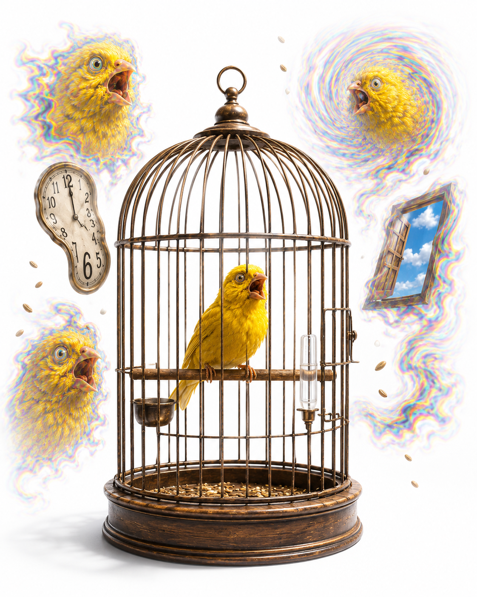
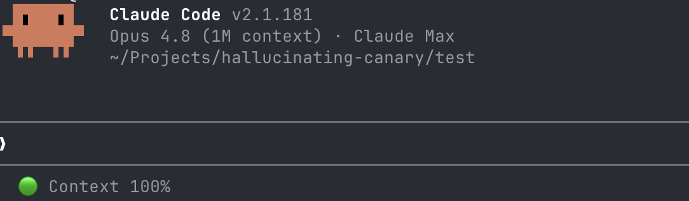

<div align="center">
  
</div>

# HallucinatingCanary
marinus@telic.co.za


> *A canary in the coal mine for your Claude Code context.*


<div align="center">
  
</div>


A lightweight [Claude Code](https://claude.com/claude-code) plugin that gives you
an **early warning when Claude's responses are about to degrade** — the drift,
forgotten instructions, and hallucinations you'd otherwise only notice *after*
they've landed in your work.

## The Problem

In a long session, response quality decays silently. Claude forgets earlier
instructions, loses track of decisions, and starts to hallucinate — and you
usually find out only when it produces something wrong. There's no cheap, direct
signal for "quality is dropping right now."

## The Idea: use a canary as a proxy

You can't measure "hallucination" directly and cheaply. But you *can* measure the
**conditions that cause it**. The biggest driver of degradation in a long session
is **context loss** — when Claude Code compacts/summarizes the conversation and
your earlier context gets dropped or distorted, the model starts filling gaps by
guessing.

So HallucinatingCanary plants known marker tokens ("canaries") in the context at
session start and watches whether they survive. **A missing canary is a proxy
signal that the context conditions which produce degradation and hallucination
have arrived** — an early warning, before bad output shows up.

Like a canary in a coal mine: the bird doesn't measure the gas: its distress
warns you the air has turned dangerous. The canary here doesn't fact-check
Claude's answers; its disappearance warns you that you've entered the regime
where hallucination becomes likely.

- ✅ Early warning of **response degradation** (drift / forgetting / hallucination)
- ✅ Detects its leading cause — **context loss via compaction** — and context-window pressure
- ⚠️ It's a **proxy / smoke alarm**, not a correctness oracle: it flags the *conditions* for degradation, not individual wrong answers

## How it works

| Component | Trigger | Job |
|---|---|---|
| Canary injector | `SessionStart` hook | Plant + inject anchors; self-initialize; re-measure & re-plant after compaction |
| Compaction watcher | `PreCompact` hook | Snapshot anchor presence before summarization |
| Survival refresh | `UserPromptSubmit` hook | Token-free re-check of anchor survival each turn |
| Indicator | `statusLine` command | `🟢/🟡/🔴 Context N%` |

Detection is **deterministic**: anchor survival is measured by inspecting the
transcript file (which hooks and the statusline already receive), never by
spending a model turn. The critical subtlety — handled in
[`plugin/bin/canary_lib.py`](plugin/bin/canary_lib.py) — is that the transcript
retains full pre-compaction history, so survival is measured only over the
**post-compaction live window**.

## Design properties

- **No dependencies to install** — Python 3 stdlib only (preinstalled on
  macOS/Linux). No `pip`, no Node.
- **No recurring permission prompts** — hooks and statusline run automatically;
  first-run setup happens inside the SessionStart hook, not via a command.
- **No external services**, no network, no background daemon.
- The only turn-consuming action is the opt-in `/hallucinating-canary:check`.

## Installation

### Method 1: Install from GitHub (Recommended)

The easiest way — two commands, no cloning. Run these **in Claude Code**:

```text
/plugin marketplace add marinus/hallucinating-canary
/plugin install hallucinating-canary@hallucinating-canary
```

Or run them **in your terminal**:

```bash
claude plugin marketplace add marinus/hallucinating-canary
claude plugin install hallucinating-canary@hallucinating-canary
```

That's it. The indicator appears in your statusline on your **next** session.

> restart Claude Code if the "🟢 Context 100%" doesn't appear

### Method 2: Clone, then Install

Use this if you want to read, modify, or contribute to the code first.

**Step 1 — Clone the repo:**

```bash
git clone https://github.com/marinus/hallucinating-canary.git
cd hallucinating-canary
```

**Step 2 — Install from your local clone.** In Claude Code:

```text
/plugin marketplace add /path/to/hallucinating-canary
/plugin install hallucinating-canary@hallucinating-canary
```

Or in your terminal:

```bash
claude plugin marketplace add /path/to/hallucinating-canary
claude plugin install hallucinating-canary@hallucinating-canary
```

Replace `/path/to/hallucinating-canary` with your clone's full path (e.g.
`/Users/yourname/Projects/hallucinating-canary`).

> **Tip — just trying it out?** For a throwaway, session-only run that doesn't
> install anything, clone the repo and start Claude Code with the plugin mounted:
> `claude --plugin-dir ./plugin`. The plugin is active only for that session.

### Initial Setup

After installation, no manual setup is required. On your **first session**:

- The SessionStart hook automatically creates:
  - `.hallucinating-canary.json` (config, gitignored)
  - `.claude/hallucinating-canary/` (state directory)
  - Statusline wiring (if `autoWireStatusline: true`)

- The indicator appears on your **next** session

### Configuration

To adjust settings, edit `.hallucinating-canary.json` in your project root:

```json
{
  "enabled": true,                  # toggle on/off
  "canaryCount": 3,                 # number of anchors to plant
  "warningThreshold": 70,           # yellow % (context loss)
  "criticalThreshold": 40,          # red % (severe loss)
  "reinjectOnCompact": true,        # re-plant after compaction
  "autoWireStatusline": true        # auto-wire main statusline
}
```

### Uninstall

To remove the plugin:

**In Claude Code:**
```text
/plugin uninstall hallucinating-canary
```

**From the terminal:**
```bash
claude plugin uninstall hallucinating-canary
```

**Clean up generated files (optional):**
The plugin creates a few files in your project when it first runs. You can safely delete them:

```bash
rm .hallucinating-canary.json
rm -rf .claude/hallucinating-canary/
```

If you edited `.claude/settings.local.json` to add the statusline, you may want to remove the `statusLine` entry pointing to the plugin.

### Requirements

- **Python 3** on `PATH` (preinstalled on macOS/Linux)
- **Windows only**: [Install Python 3](https://www.python.org/downloads/) and
  ensure `python3` is on your PATH
- No other dependencies (Python stdlib only)

## Repository layout

```
.
├── .claude-plugin/marketplace.json # makes this repo an installable marketplace
├── spec.md                        # full design spec (verified against Claude Code v2.1.179)
├── experiments/
│   └── canary-survival.md         # validation protocol for the compaction-survival signal
├── plugin/                        # the plugin itself
│   ├── .claude-plugin/plugin.json
│   ├── settings.json              # ships subagentStatusLine
│   ├── hooks/hooks.json
│   ├── bin/*.py                   # hooks, statusline, shared lib, optional CLI
│   ├── skills/check/              # the one opt-in slash command
│   ├── test/smoke.py              # end-to-end test harness
│   ├── test/inspect.py            # live-state inspector
│   └── README.md                  # plugin-level docs
└── README.md                      # this file
```

## Testing

```bash
python3 plugin/test/smoke.py        # deterministic end-to-end checks (no Claude Code needed)
python3 plugin/test/inspect.py      # inspect live state for ~/cc-canary-test
```

## Status

- ✅ Deterministic logic (injection, live-window survival, health, statusline,
  auto-setup) — covered by `smoke.py`.
- ✅ Statusline data contract (`context_window.used_percentage`) — verified
  against the installed Claude Code binary.
- ⚠️ **Unverified:** the proxy's strength. Two open questions:
  1. The compaction-boundary heuristic (`is_compaction_summary`) is a best-guess
     until checked against a real compacted transcript.
  2. *How well canary survival actually predicts degradation* — the core proxy
     assumption. 
  
See [`plugin/README.md`](plugin/README.md) for plugin internals.
